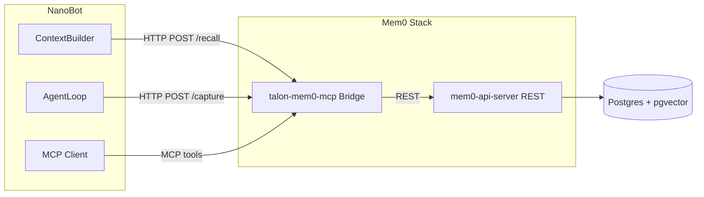

# Mem0 as Remote MCP-Backed Service

## Why Remote MCP

Per [AGENTS.md](../AGENTS.md): "Prefer remote MCP services over baking Talon integrations into NanoBot core." Running Mem0 as a remote service keeps memory logic out of NanoBot, makes the stack rebase-friendly, and matches the existing Talon MCP bridge pattern.

## Architecture



- **mem0-api-server**: Official Mem0 OSS REST API (Docker image `mem0/mem0-api-server` or build from [mem0](https://github.com/mem0ai/mem0) repo). Exposes `POST /memories`, `GET /memories/search`, `GET /memories/{id}`, `DELETE /memories/{id}`, etc.
- **talon-mem0-mcp**: Thin bridge that (1) wraps Mem0 REST and exposes MCP tools, (2) exposes REST endpoints for recall and capture that NanoBot calls directly. Single point of contact for NanoBot.
- **NanoBot**: Adds mem0 to `tools.mcpServers` for agent-invoked tools; calls HTTP recall/capture endpoints for auto-recall and auto-capture.

## Service Topology

| Service | Role | Port | Depends On |
|---------|------|------|------------|
| mem0-api-server | Mem0 OSS REST API | 8000 | postgres |
| talon-mem0-mcp | MCP bridge + recall/capture REST | 3002 | mem0-api-server |
| postgres | pgvector for Mem0 | 5432 | — |

NanoBot config:
- `tools.mcpServers.mem0.url` → `http://talon-mem0-mcp:3002/mcp` (SSE or streamableHttp)
- `mem0.enabled` → true
- `mem0.api_url` → `http://talon-mem0-mcp:3002` (for recall/capture REST, not the raw Mem0 API)

## talon-mem0-mcp Bridge

**Responsibilities**:
1. **MCP server** — Expose tools that wrap Mem0 REST: `add_memory`, `search_memories`, `get_memories`, `get_memory`, `delete_memory` (or equivalent to OpenClaw’s 5-tool model).
2. **REST endpoints for recall/capture**:
   - `POST /recall` — Body: `{ query, user_id, run_id?, top_k? }` → calls Mem0 `GET /memories/search`, returns formatted memories for prompt injection.
   - `POST /capture` — Body: `{ messages, user_id, run_id? }` → calls Mem0 `POST /memories` with the exchange for extraction.

**Implementation**: Python (FastAPI) or Node.js MCP server. Small codebase that proxies to `MEM0_API_URL` (env). Can live in `services/mem0-mcp/`.

## NanoBot Changes

### Config ([nanobot/config/schema.py](nanobot/config/schema.py))

```python
class Mem0Config(Base):
    enabled: bool = False
    api_url: str = "http://localhost:3002"  # talon-mem0-mcp base URL
    user_id: str = "default"
    auto_recall: bool = True
    auto_capture: bool = True
    top_k: int = 5
```

Wire into `Config`. When `mem0.enabled`, also ensure `mem0` is in `tools.mcpServers` (or document that operators must add it).

### HTTP Client for Recall/Capture

New module `nanobot/agent/memory_mem0_client.py`:
- `Mem0Client(api_url, user_id, top_k)` — thin async HTTP client (httpx).
- `recall(query, run_id?) -> str` — POST to `/recall`, format results as prompt section.
- `capture(messages, run_id?) -> None` — POST to `/capture`.

No `mem0ai` dependency; only `httpx`.

### ContextBuilder ([nanobot/agent/context.py](nanobot/agent/context.py))

When `mem0.enabled` and `mem0.auto_recall`:
- `build_messages()` receives `current_message` and `session_key`.
- Before building, call `mem0_client.recall(current_message, run_id=session_key)`.
- Inject result as `# Relevant Memories` into system prompt (or before user message).
- Fallback: when Mem0 disabled, use existing `MemoryStore.get_memory_context()`.

### AgentLoop ([nanobot/agent/loop.py](nanobot/agent/loop.py))

When `mem0.enabled` and `mem0.auto_capture`:
- After `_save_turn()` and before returning, fire background task: `mem0_client.capture([user_msg, assistant_msg], run_id=session.key)`.
- When Mem0 enabled: skip `_consolidate_memory()` (no file-based consolidation).
- MCP tools come automatically from `tools.mcpServers.mem0` via existing [nanobot/agent/tools/mcp.py](nanobot/agent/tools/mcp.py) — no new tool code in NanoBot.

### Identity Prompt ([nanobot/agent/context.py](nanobot/agent/context.py))

When Mem0 enabled: remove references to `MEMORY.md` / `HISTORY.md` file paths. Replace with: "Memory is managed via Mem0. Relevant memories are recalled automatically. Use the memory tools (add_memory, search_memories, etc.) for explicit operations."

## Docker Compose Additions

```yaml
mem0-api-server:
  image: mem0/mem0-api-server
  # or build from mem0 repo server/
  environment:
    OPENAI_API_KEY: ${OPENAI_API_KEY}
    # vector store, etc. per Mem0 docs
  depends_on:
    postgres: { condition: service_healthy }
  networks: [talon-net]

talon-mem0-mcp:
  build: ./services/mem0-mcp
  environment:
    MEM0_API_URL: http://mem0-api-server:8000
  depends_on: [mem0-api-server]
  networks: [talon-net]
  # Expose MCP at :3002
```

Postgres (if not already present) needs pgvector; Mem0 API uses it for embeddings.

## Alignment With Existing Plans

- **Replaces** `talon-memory-api` from [00-nanobot-talon-integration-plan.md](00-nanobot-talon-integration-plan.md) — Mem0 OSS is the memory backend; no custom FastAPI memory service.
- **Defers** three-tier governance (core/episodic/provisional) and approval UI — Mem0 uses simpler session vs long-term scopes. Can be layered later via Mem0 metadata or a separate service.
- **Complements** [talon_fork_phases_e4896c1f.plan.md](talon_fork_phases_e4896c1f.plan.md) — Phase 0 seams (disable NanoBot self-authoring) still apply; Mem0 becomes the external memory authority.

## Files Changed

| File | Action |
|------|--------|
| `nanobot/config/schema.py` | Add Mem0Config, wire into Config |
| `nanobot/agent/memory_mem0_client.py` | **Create** — HTTP client for recall/capture |
| `nanobot/agent/context.py` | Gate memory injection on Mem0, call recall when enabled |
| `nanobot/agent/loop.py` | Gate consolidation, add capture hook, ensure MCP config |
| `services/mem0-mcp/` | **Create** — MCP bridge + /recall, /capture REST |
| `docker-compose.yml` | Add mem0-api-server, talon-mem0-mcp, postgres if missing |
| `tests/test_mem0_*.py` | **Create** — Client and integration tests |

## Rebase Friendliness

- New code in `memory_mem0_client.py` and `services/mem0-mcp/`; no changes to upstream NanoBot tool registry or MCP client.
- Config-gated: when `mem0.enabled` is false, behavior matches stock NanoBot.
- Memory tools are discovered via MCP like searxng, ntfy, bird — no hard-coded Mem0 tool definitions in NanoBot.
