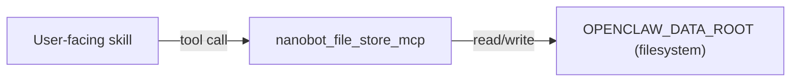

## Nanobot File Store MCP Plan

### Goals

- **Single generic document-store MCP** for all OpenClaw-style mini apps that need durable, file-backed state (journals, todos/projects, news analysis, portfolio, future apps).
- **Abstract file I/O behind tools** so NanoBot/Talon core and skills never manipulate raw paths directly.
- **Convention-over-configuration layout** for dated and named documents, with minimal required parameters per call.
- **Extensible design** that can support new app domains, templates, search, and versioning without breaking existing tools.

### Scope

- **In scope**
  - New MCP server implementation in `[services/nanobot-file-store-mcp/](/Users/philipclapper/workspace/nanobot-talon/services/nanobot-file-store-mcp/)` (name can be adjusted slightly as needed).
  - Core CRUD-style tools on logical documents, not raw bytes.
  - Opinionated directory layout under a shared root (e.g. `workspace/openclaw-data/`).
  - Helper tools for daily/dated documents.
  - Example usage patterns for journals, todos/projects, news, and portfolios.
- **Out of scope (initially)**
  - Full-text indexing or vector search.
  - Cross-process file locking beyond basic best-effort protections.
  - Encryption at rest (can be layered later).

### High-Level Architecture

- **Components**
  - **NanoBot / OpenClaw skills**: Call MCP tools with domain-specific parameters (`app`, `id`, etc.).
  - `**nanobot-file-store-mcp`**: Node/TypeScript MCP server exposing document-oriented tools.
  - **Filesystem data root**: A single directory configured at startup (e.g. `OPENCLAW_DATA_ROOT` env var), inside which all app-specific subtrees live.
- **Flow**
  - Skill decides which logical document it needs (e.g. `app="journal"`, `id="2026-03-08"`).
  - Calls MCP tool (`ensure_daily_document`, `read_document`, etc.).
  - MCP resolves to physical path based on conventions, performs I/O + validation, and returns structured results.




### Data & Path Model

- **Root directory**
  - Configured via env (e.g. `OPENCLAW_DATA_ROOT`) or MCP config argument.
  - All operations are strictly sandboxed under this root.
- **App subdirectories** (examples)
  - Journals: `journal/YYYY/MM/YYYY-MM-DD.md`
  - Todos: `todos/inbox.json`, `todos/daily/YYYY/MM/YYYY-MM-DD.json`
  - Projects: `projects/<slug>.json`
  - News: `news/YYYY/MM/YYYY-MM-DD.md`, `news/topics/<topic>.md`
  - Portfolio: `portfolio/current.json`, `portfolio/snapshots/YYYY-MM-DD.json`
- **File formats**
  - **Markdown + YAML frontmatter** for narrative content (journals, news notes):
    - Fields: `date`, `tags`, `source_urls`, `tickers`, etc.
  - **JSON** for structured state (todos, projects, portfolio, configs):
    - Fields: domain-specific but validated in the MCP where feasible.
- **Conventions**
  - `app` (string) → top-level directory under root.
  - `id` (string) → canonical identifier mapped to a path depending on app/doc_type (e.g. `2026-03-08`, `inbox`, `project-slug`).
  - Optional `doc_type` / `kind` flag to disambiguate patterns within an app (`daily`, `snapshot`, `config`).

### MCP Tool API (Initial Set)

Design the tool schemas in TypeScript for MCP, roughly:

- `**list_documents`**
  - **Inputs**: `app` (required), `doc_type?`, `since?`, `until?`, `limit?`, `includeContent?` (bool, default false).
  - **Behavior**: Scan appropriate directory subtree under `app`, apply optional date and type filters, return small metadata objects (filename, id, timestamps, size, tags/frontmatter) and optionally content.
- `**read_document`**
  - **Inputs**: `app`, `id`, `doc_type?`.
  - **Behavior**: Map to path, ensure it is inside root, read content, infer or parse metadata (frontmatter/JSON), return `{ app, id, path, metadata, content }`.
- `**write_document`**
  - **Inputs**: `app`, `id`, `doc_type?`, `content`, `metadata?`, `upsert?` (default true), `ifNotExists?` (optional guard).
  - **Behavior**: Create intermediate directories as needed, optionally merge metadata/frontmatter, and atomically write the file (e.g. write temp then rename).
- `**patch_document`** (optional but powerful)
  - **Inputs**: `app`, `id`, `doc_type?`, `operations[]`.
  - **Operations**:
    - For JSON: RFC-6902-like JSON Patch operations (`add`, `remove`, `replace`, `move`, `copy`, `test`).
    - For Markdown: simpler operations like `append_section`, `prepend`, `replace_between_markers`.
  - **Behavior**: Load document, apply operations, validate, write back atomically.
- `**delete_document`**
  - **Inputs**: `app`, `id`, `doc_type?`, `mode` (`"trash" | "hard"`, default `"trash"`).
  - **Behavior**: Either move file to `trash/` subtree with timestamp prefix, or permanently delete.
- `**ensure_daily_document`**
  - **Inputs**: `app`, `date` (ISO date), `doc_type?` (e.g. `"daily_journal"`, `"daily_todos"`), `template_name?`, `metadata?`.
  - **Behavior**: Based on `app` and `doc_type`, derive path for that date; if not present, create from a template (see next section), then return the document as in `read_document`.
- `**search_documents`** (simple initial version)
  - **Inputs**: `app`, `query` (string), `maxResults?`, `filenameOnly?`.
  - **Behavior**: Grep-like search over filenames and/or contents under `app` root, returning matching document IDs and snippets (non-indexed, simple but useful).

### Template System

- **Template storage**
  - Directory under root: `templates/<app>/<doc_type>.md` or `.json`.
  - Example: `templates/journal/daily.md`, `templates/todos/daily.json`, `templates/news/daily.md`.
- **Template resolution**
  - `ensure_daily_document` (and potentially other tools) accept `template_name`.
  - Resolution order (example):
    1. Explicit `template_name` if provided: `templates/<app>/<template_name>.`*.
    2. Default for `doc_type`: `templates/<app>/<doc_type>.`*.
    3. Fallback: built-in minimal template if no file exists.
- **Variable substitution**
  - Support simple placeholders, e.g. `{{date}}`, `{{weekday}}`, `{{app}}`.
  - Can be extended later with more metadata-driven substitution.

### Error Handling & Validation

- **General rules**
  - Always enforce sandbox: no `..` in path segments; resolved paths must remain under `OPENCLAW_DATA_ROOT`.
  - Return structured MCP errors with clear messages (e.g. `NOT_FOUND`, `VALIDATION_ERROR`, `IO_ERROR`).
  - Log internal details for debugging but keep tool responses concise.
- **JSON docs**
  - Optionally validate against lightweight schemas per `app`/`doc_type` (hard-coded or loaded from a `schemas/` directory).
  - On validation failure, return a descriptive error including the path that failed.
- **Markdown docs**
  - On malformed frontmatter, either:
    - Treat as plain text and warn, or
    - Fail with a specific `METADATA_PARSE_ERROR` depending on strictness configuration.

### Security & Concurrency Considerations

- **Security**
  - No arbitrary path input; all paths constructed from `app`, `id`, and known patterns.
  - Optional allowlist of `app` names in server config.
- **Concurrency**
  - Use best-effort file locking or atomic writes by default:
    - Write to temp file and `rename` to target.
    - Optionally support `version` / `etag` fields so callers can detect overwrites.

### Implementation Structure

Proposed layout under `services/nanobot-file-store-mcp/`:

- `[services/nanobot-file-store-mcp/package.json](/Users/philipclapper/workspace/nanobot-talon/services/nanobot-file-store-mcp/package.json)`
  - Name, build scripts (`tsc`), dependencies (MCP SDK, YAML parser, JSON schema lib, etc.).
- `[services/nanobot-file-store-mcp/tsconfig.json](/Users/philipclapper/workspace/nanobot-talon/services/nanobot-file-store-mcp/tsconfig.json)`
- `[services/nanobot-file-store-mcp/src/index.ts](/Users/philipclapper/workspace/nanobot-talon/services/nanobot-file-store-mcp/src/index.ts)`
  - MCP server entrypoint, tool registration, config parsing.
- `[services/nanobot-file-store-mcp/src/config.ts](/Users/philipclapper/workspace/nanobot-talon/services/nanobot-file-store-mcp/src/config.ts)`
  - Types and helpers for `OPENCLAW_DATA_ROOT`, allowed apps, etc.
- `[services/nanobot-file-store-mcp/src/pathMapping.ts](/Users/philipclapper/workspace/nanobot-talon/services/nanobot-file-store-mcp/src/pathMapping.ts)`
  - Logic to map `{app, id, doc_type, date}` to concrete filesystem paths.
- `[services/nanobot-file-store-mcp/src/fsAdapter.ts](/Users/philipclapper/workspace/nanobot-talon/services/nanobot-file-store-mcp/src/fsAdapter.ts)`
  - Thin safe wrapper around Node `fs` with sandbox and atomic-write helpers.
- `[services/nanobot-file-store-mcp/src/templates.ts](/Users/philipclapper/workspace/nanobot-talon/services/nanobot-file-store-mcp/src/templates.ts)`
  - Template loading and placeholder substitution logic.
- `[services/nanobot-file-store-mcp/src/tools/](/Users/philipclapper/workspace/nanobot-talon/services/nanobot-file-store-mcp/src/tools/)`
  - One module per MCP tool (`listDocuments.ts`, `readDocument.ts`, `writeDocument.ts`, etc.).
- `[services/nanobot-file-store-mcp/README.md](/Users/philipclapper/workspace/nanobot-talon/services/nanobot-file-store-mcp/README.md)`
  - Usage, config example, and documented tools (mirroring style of `services/bird-mcp/README.md`).

### Config & Integration with NanoBot

- **Config snippet example** (in NanoBot `config.json` or equivalent):

```json
"nanobot-file-store": {
  "command": "node",
  "args": ["/app/services/nanobot-file-store-mcp/dist/index.js"],
  "env": {
    "OPENCLAW_DATA_ROOT": "/workspace/openclaw-data"
  },
  "toolTimeout": 30
}
```

- **Skill integration patterns**
  - Journals: skill calls `ensure_daily_document(app="journal", date=today, doc_type="daily_journal")`, then uses `write_document`/`patch_document` to add entries.
  - Todos: skill calls `read_document(app="todos", id="inbox")`, mutates JSON object, then `write_document`.
  - News: skill calls `ensure_daily_document(app="news", date=today, doc_type="daily_news")` to append summaries or links.
  - Portfolio: skill uses `read_document(app="portfolio", id="current")` to see state and `write_document` / `patch_document` to update; optional `write_document(app="portfolio", id="snapshot-<date>", ...)` to take snapshots.

### Testing Strategy

- **Unit tests** for:
  - Path mapping logic (app/id/date → path) including error cases and sandbox checks.
  - Template resolution and variable substitution.
  - JSON and Markdown metadata parsing/validation.
- **Integration tests** for tools:
  - Create a temporary directory as `OPENCLAW_DATA_ROOT`.
  - Exercise each MCP tool (list/read/write/patch/delete/ensure_daily_document/search) end-to-end.

### Future Extensions

- **Schema-driven validation**
  - Load JSON Schemas or simple YAML definitions per app/doc_type from a `schemas/` directory to validate documents more formally.
- **Versioning & history tools**
  - Add `list_versions` and `read_version` tools that leverage a `versions/` subtree or Git integration.
- **Indexing/search MCP**
  - Optionally introduce a separate search-oriented MCP that indexes the same root, leaving this server focused strictly on file management.
- **Encryption & secrets handling**
  - Option to encrypt certain app directories or fields using a configured key management strategy.

