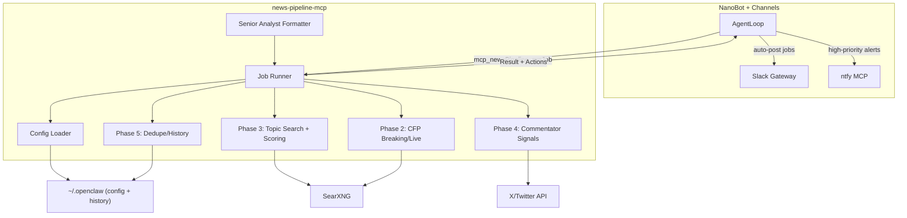

## News-Pipeline MCP Design

### Goals & Scope

- **Primary goal**: Translate the current OpenClaw news pipeline (breaking news, intel signals, GA sweeps, etc.) into a **single `news-pipeline` MCP server** that NanoBot can call, while:
  - Reusing the `~/.openclaw` directory structure and job concepts where it’s clearly helpful.
  - Making room for **light refactors** (e.g., clearer config schemas, better history handling) where they provide obvious, low-friction improvements.
  - Preserving your **scoring model, quiet window behavior, dedupe/history, and Senior Analyst output format**.
- **Delivery model**: The MCP always returns **structured results**, and **per-job delivery policy** decides whether NanoBot auto-posts to Slack/ntfy or surfaces results for review.

### High-Level Architecture




### Service Layout & Technology Choice

- **Service root**: `services/news-pipeline-mcp/` (mirrors `services/bird-mcp/` and `services/mem0-mcp/`).
- **Implementation language** (recommended):
  - Use **Node/TypeScript + `@modelcontextprotocol/sdk`** for symmetry with `bird-mcp` and the planned `nanobot-file-store-mcp`.
  - Structure:
    - Entry: `[services/news-pipeline-mcp/src/index.ts](services/news-pipeline-mcp/src/index.ts)`
    - Build: `tsc` to `[services/news-pipeline-mcp/dist/index.js](services/news-pipeline-mcp/dist/index.js)`
    - `package.json` patterned after `[services/bird-mcp/package.json](services/bird-mcp/package.json)`.
- **Configurable base directory**:
  - Introduce `OPENCLAW_BASE_DIR` env var (defaulting to `~/.openclaw` inside the runtime container).
  - All existing file paths become **relative to this base** (so we can preserve your directory tree but make it portable):
    - `data/priority_topics.md`, `data/urgency_keywords.md`, `data/ignored_topics.md`
    - `workspace/sources/*.md`
    - `news_history.json`, `georgia_news_history.json`, etc.

### Tools Exposed by `news-pipeline` MCP

Design a small set of **high-level, job-centric tools** plus a few **lower-level utilities** for debugging and ad-hoc use:

- `**news_run_job`**
  - **Purpose**: Run a named news job according to `cron/jobs.json` semantics and return fully formatted bullets + suggested actions.
  - **Input** (zod schema):
    - `jobId: string` – e.g. `breaking-news-sweep`, `georgia-morning-sweep`.
    - `overrideQuietWindow?: boolean` – allow force-running during the Sunday quiet window.
    - `dryRun?: boolean` – compute everything but **do not mutate history files**.
  - **Output**:
    - `jobId`, `runId`, `timestamp`.
    - `items: NewsItem[]` (each with topic, score, scoreBreakdown, url, channelHint, formattedSlackText, priorityFlag, seenBefore).
    - `deliveryPolicy: { mode: "autoPost" | "previewOnly" | "returnOnly", channels: string[], ntfy: boolean }` resolved for this job.
- `**news_preview_breaking_news`** (specialized UI-friendly wrapper for the breaking-news pipeline)
  - Runs the **Phase 0–6** pipeline for breaking news only and returns:
    - Sorted list of candidates.
    - Any auto-scored 9–10 items flagged for ntfy.
    - Separate lists for `#breaking-news` and `#intel-signals`.
- `**news_get_config`**
  - Read-only tool that exposes a structured view of:
    - Parsed priority topics, urgency keywords, ignored topics.
    - Job definitions from `cron/jobs.json`.
    - Commentator list from `workspace/sources/commentators.md`.
  - Used by agents for introspection and debugging.
- `**news_get_history_status`**
  - Summarize the history/dedupe state for a topic or URL.
  - Handy for verifying that `check_news_seen` behavior is working correctly once ported.

These tools will be wired via the MCP SDK similar to how `[services/bird-mcp/src/index.ts](services/bird-mcp/src/index.ts)` registers `bird_`* tools.

### Mapping Existing Pipeline Phases to MCP Logic

- **Phase 0: Sunday Quiet Window (6 AM – 12:30 PM ET)**
  - Implement as a **first-class guard** inside `news_run_job` and `news_preview_breaking_news`.
  - Behavior:
    - If now is within the quiet window and `overrideQuietWindow` is false, return:
      - `items: []` and a `status: "quiet-window"` flag.
    - No history updates in this case.
- **Phase 1: Load Config**
  - Implement a `ConfigLoader` module that reads from `OPENCLAW_BASE_DIR`:
    - `[data/priority_topics.md](~/.openclaw/data/priority_topics.md)` → parsed into `{ topic: string; multiplier: number; tags?: string[] }[]`.
    - `[data/urgency_keywords.md](~/.openclaw/data/urgency_keywords.md)` → `{ keyword: string; weight: number }[]`.
    - `[data/ignored_topics.md](~/.openclaw/data/ignored_topics.md)` → `string[]`.
    - `[workspace/sources/commentators.md](~/.openclaw/workspace/sources/commentators.md)` → `{ handle: string; label: string }[]`.
  - Optionally add a **thin JSON cache** layer (`.cache/config.json`) to avoid re-parsing MD on every call, invalidating when mtime changes.
- **Phase 2: CFP Breaking/Live Detection**
  - Inside the MCP, implement a `cfpScanner` that:
    - Hits SearXNG with `site:citizenfreepress.com` queries for `BREAKING` and `LIVE` badges (mirroring current behavior).
    - Applies your rules:
      - `BREAKING` + priority topic → score = 9, auto-eligible.
      - `LIVE` + priority topic → score = 8, auto-eligible.
  - Represent results as structured `NewsItem` objects with an `origin: "cfp"` and `badge: "BREAKING" | "LIVE" | null`.
- **Phase 3: Topic Search + Urgency Scoring**
  - Implement a `topicSearch` module that:
    - Iterates priority topics from Phase 1.
    - For each topic, calls SearXNG (base URL configured the same way as NanoBot’s search: via env or a small MCP config file) with **time bounded to last 6 hours**.
    - Computes score as:
      - `score = (sum(keyword_weights) * topic_multiplier)`.
    - Applies threshold:
      - If `score >= 7`, mark as qualifying for `#breaking-news`.
  - Return full `scoreBreakdown` and `matchedKeywords` in the MCP response for transparency.
- **Phase 4: Commentator Narrative Signals**
  - Use X/Twitter API access similar to your current pipeline:
    - Either call X directly from `news-pipeline-mcp` (reusing the same cookie/token approach as `bird-mcp` but confined to this service), **or**
    - Reuse the same configuration inputs as `bird-mcp` (e.g., `AUTH_TOKEN`, `CT0`) and mirror its internal client.
  - Focus on the handles you specified: `@RodDMartin`, `@Maximus_4EVR`, `@DecisionDeskHQ`, `@MikeBenzCyber`.
  - Produce `NarrativeSignal` structures for `#intel-signals` with fields like `commentator`, `headline`, `sentiment`, `link`.
- **Phase 5: Dedupe Check**
  - Port `check_news_seen` / `check_georgia_news_seen` behavior into a `HistoryStore` module:
    - Read/write from:
      - `[~/.openclaw/news_history.json](~/.openclaw/news_history.json)` and `[~/.openclaw/georgia_news_history.json](~/.openclaw/georgia_news_history.json)` as primaries.
      - Keep `workspace/news_history.json` and `/root/news_history.json` as backup/compat if you still want redundancy (optional, low-priority refactor step).
    - Normalize keys:
      - e.g., by canonical URL + topic.
    - Ensure **only unseen stories** are allowed to proceed to posting.
  - `news_get_history_status` exposes a read-only view of this state.
- **Phase 6: Format for #breaking-news + ntfy**
  - Implement a `SlackFormatter` that enforces your Senior Analyst format:
    - Every line starts with `>` *.
    - Emoji at start of bullet (e.g. `🚨` for breaking, `📰` for standard).
    - Headline in single-asterisk bold: `*Headline`*.
    - Embedded links in `<url|text>` form inside the sentence.
    - 1–2 sentences per bullet, no intros/outros.
  - `news-pipeline-mcp` will **not** push to Slack/ntfy directly; instead it returns:
    - `formattedSlackText` per item.
    - `priorityFlag` + `priorityScore`.
    - A `suggestedActions` array with entries like `{ type: "postSlack", channel: "#breaking-news", line: "..." }` and `{ type: "sendNtfy", topic: "cipher-notifications", title: "..." }`.
  - NanoBot/agents use per-job delivery policy to decide whether to:
    - Auto-call Slack/ntfy tools.
    - Or present the messages to you for approval.
- **Phase 7: Format for #intel-signals**
  - Reuse the same formatter with different emoji and channel hints:
    - Format: `> * 🎙️ *[Commentator]* — <url|embedded link>`.
  - Include this in `items` with `channelHint: "#intel-signals"`.

### Job Definitions & Per-Job Delivery Policy

- **Existing job registry**
  - Keep `cron/jobs.json` as the central job list (or create it if it’s currently ad-hoc) at `[~/.openclaw/cron/jobs.json](~/.openclaw/cron/jobs.json)`.
- **Extend job schema** to support MCP + delivery behavior, e.g.:
  - `id: string`
  - `type: "breaking" | "intel" | "georgia" | "weather" | "portfolio" | ...`
  - `description: string`
  - `scheduleHint?: string` (for external cron or NanoBot scheduling)
  - `deliveryPolicy: { mode: "autoPost" | "previewOnly" | "returnOnly", channels: string[], ntfy: boolean }`
- **How this is used**:
  - `news_run_job(jobId)` resolves `deliveryPolicy` and includes it in the MCP response.
  - On the NanoBot side:
    - For `autoPost` jobs, the responsible agent (e.g. gateway/Slack channel agent) iterates `suggestedActions` and invokes:
      - Slack gateway (for channel posts).
      - `ntfy` MCP (for high-priority alerts to `https://ntfy.informedcrew.com/cipher-notifications`).
    - For `previewOnly` or `returnOnly`, agents show results to you instead.

### NanoBot Integration

- **Configuring MCP server**
  - Add a new MCP server entry in `~/.nanobot/config.json` under `tools.mcpServers` (patterned after `bird`):
    - **stdio variant (Node process inside same container)**:

```json
      {
        "tools": {
          "mcpServers": {
            "newsPipeline": {
              "command": "node",
              "args": ["/app/services/news-pipeline-mcp/dist/index.js"],
              "env": {
                "OPENCLAW_BASE_DIR": "/root/.openclaw",
                "SEARXNG_BASE_URL": "http://searxng:8080",
                "X_AUTH_TOKEN": "...",
                "X_CT0": "..."
              },
              "toolTimeout": 60
            }
          }
        }
      }
      

```

- **Tool names in NanoBot**
  - After connection, tools will appear as `mcp_newsPipeline_news_run_job`, `mcp_newsPipeline_news_preview_breaking_news`, etc., via `MCPToolWrapper` in `[nanobot/agent/tools/mcp.py](nanobot/agent/tools/mcp.py)`.
  - Agents and channels can then:
    - Use `news_preview_breaking_news` for interactive runs.
    - Use `news_run_job` in scheduled flows.
- **Scheduling & agent responsibilities**
  - For jobs currently run by `analyst` vs `main (Cipher)`, capture that as metadata in `cron/jobs.json` (e.g., `owner: "analyst" | "cipher"`).
  - The NanoBot gateway/agents for those workspaces call `news_run_job(jobId)` according to their schedules and apply `deliveryPolicy`.

### Backwards Compatibility & Data Migration

- **History files**
  - Continue to read/write the existing JSON files (`news_history.json`, `georgia_news_history.json`), but:
    - Normalize the schema internally in the MCP (e.g. ensure consistent keys, timestamps, topics).
    - Optionally add lightweight migration on first run to clean/normalize entries while preserving content.
- **Legacy `news_seen.json` and `/root/news_history.json`**
  - Treat these as **read-only compatibility sources**:
    - MCP can consult them when deduping older content.
    - Prefer writing only to the new primary history files going forward.
- **Config markdown**
  - Preserve current `.md` files as **source-of-truth** for now.
  - Optionally add a later phase to introduce structured `.json` mirrors while keeping `.md` for editing and documentation.

### Future Enhancements (Optional, Later)

- Add tools for **weather** and **portfolio SMA200 analysis** that reuse the same scoring + formatting engine but plug into different data feeds.
- Factor out a small shared **scoring DSL** for topics/keywords so you can tweak scoring without code changes.
- Add `news_explain_score` tool that, for a given URL, returns an explanation of how its score was computed.

### Implementation Todos

- **Design & Setup**
  - Define the precise `NewsItem`, `NarrativeSignal`, `DeliveryPolicy`, and `JobDefinition` TypeScript interfaces.
  - Create `services/news-pipeline-mcp/` with `package.json`, `tsconfig.json`, and `src/index.ts` modeled after `services/bird-mcp/`.
- **Core Pipeline Logic**
  - Implement `ConfigLoader`, `cfpScanner`, `topicSearch`, `narrativeCollector`, `HistoryStore`, and `SlackFormatter` modules.
  - Wire them together into `news_run_job` and `news_preview_breaking_news` tools using `@modelcontextprotocol/sdk`.
- **Integration & Config**
  - Add `newsPipeline` MCP server config to `~/.nanobot/config.json` and, if relevant, to any Docker-compose or deployment docs.
  - Update or create `docs/news-pipeline.md` and a short `services/news-pipeline-mcp/README.md` describing usage, config, and tool signatures.
- **Validation**
  - Dry-run the MCP against your current `~/.openclaw` data (with `dryRun: true`) and compare outputs to your existing pipeline.
  - Adjust scoring, thresholds, and history semantics until behavior matches expectations.

