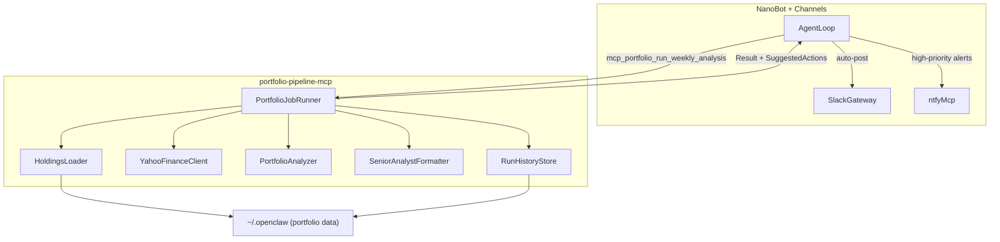

# Portfolio Pipeline MCP Design

## Goals & Scope

- **Primary goal**: Move the existing OpenClaw weekly portfolio SMA200/dividend analysis into a **dedicated `portfolio-pipeline-mcp` service** that NanoBot can call, while:
  - Reusing your `~/.openclaw` portfolio data (holdings, state, run history) where helpful.
  - Preserving your **BUY/SELL categorization, dividend-aware scoring, and Senior Analyst report format**.
  - Returning **structured results + suggested delivery actions**, letting NanoBot/agents handle Slack/ntfy posting and any higher-level narrative.
- **Out of scope (for this phase)**:
  - Full backtesting or simulation tooling (beyond the weekly job).
  - UI dashboards; focus is MCP tools + NanoBot agents and Slack output.

## High-Level Architecture




## Service Layout & Technology Choice

- **Service root**: `services/portfolio-pipeline-mcp/` (mirrors `services/bird-mcp/` and `services/news-pipeline-mcp/`).
- **Implementation**:
  - Use **Node/TypeScript + `@modelcontextprotocol/sdk`**.
  - Entry point: `[services/portfolio-pipeline-mcp/src/index.ts](services/portfolio-pipeline-mcp/src/index.ts)`.
  - Build to `[services/portfolio-pipeline-mcp/dist/index.js](services/portfolio-pipeline-mcp/dist/index.js)` via `tsc`.
  - `package.json` modeled on `[services/bird-mcp/package.json](services/bird-mcp/package.json)` but with `yahoo-finance2` as a key dependency (reusing your existing CLI skill logic conceptually).
- **Configurable base directory**:
  - Introduce `OPENCLAW_BASE_DIR` env var (default `~/.openclaw`).
  - Treat the following as **relative to this base**:
    - `[data/portfolio.json](~/.openclaw/data/portfolio.json)` – current holdings and target weights.
    - `[data/portfolio-state.json](~/.openclaw/data/portfolio-state.json)` – cached state (e.g., last prices, last run timestamp, per-ticker metadata) if you want to keep it.
    - `[cron/jobs.json](~/.openclaw/cron/jobs.json)` – optional integration for schedule/delivery metadata (shared with news pipeline).
    - `[cron/runs/portfolio-weekly-analysis.jsonl](~/.openclaw/cron/runs/portfolio-weekly-analysis.jsonl)` – legacy run log (can be mirrored or migrated).

## MCP Tools Exposed by `portfolio-pipeline-mcp`

Design a small, job-focused tool surface that keeps the service simple while supporting both scheduled and ad-hoc runs:

- `**portfolio_run_weekly_analysis`**
  - **Purpose**: Run the canonical weekly SMA200/dividend portfolio analysis.
  - **Input** (TypeScript/zod schema):
    - `refreshState?: boolean` – force-refresh any cached portfolio state instead of relying on `portfolio-state.json`.
    - `dryRun?: boolean` – compute everything but **do not update on-disk state/history**.
    - `asOf?: string` – optional ISO timestamp to treat as “now” (for testing/backfills).
  - **Output**:
    - `timestamp`, `runId`, `jobId: "portfolio-weekly-analysis"`.
    - `universeSummary`: total positions, total market value, overall dividend yield, cash weight, etc.
    - `buyCandidates[]`: each with `{ ticker, name, weight, price, sma200, discountPct, yieldPct, divScore, notes[] }`.
    - `sellCandidates[]`: `{ ticker, name, weight, price, sma200, premiumPct, yieldPct, riskFlags[] }`.
    - `dividends[]`: upcoming/recent dividends with `{ ticker, exDate, payDate, amount, yieldPct, confidence }`.
    - `picks`: `{ dividendPick?, growthPick?, highRiskFlags[] }` with rationale.
    - `formattedSlack`: pre-rendered Senior Analyst blockquoted text for `#investing`.
    - `suggestedActions[]`: `[{ type: "postSlack", channel: "#investing", text: string }]` plus any ntfy suggestions (e.g., unusually large opportunity or risk).
- `**portfolio_get_state`**
  - **Purpose**: Inspect the last run and current cached state for debugging and agent reasoning.
  - **Output**:
    - Latest run metadata (timestamp, counts, top picks).
    - Summary of holdings, last fetched prices, and any stale-data flags.
- `**portfolio_preview_ticker_set`** (optional, later)
  - **Purpose**: Run the same SMA200/dividend logic for a caller-specified list of tickers, without touching portfolio files.
  - **Use case**: Ad-hoc what-if analysis in NanoBot sessions.

## Mapping Current Weekly Flow to MCP Logic

### 1. Job Trigger & Scheduling

- **Current**: Cron triggers `portfolio-weekly-analysis` Wednesday 9:15 AM ET via `jobs.json`.
- **MCP/NanoBot**:
  - Define a `JobDefinition` entry in `[~/.openclaw/cron/jobs.json](~/.openclaw/cron/jobs.json)` (or a new `[~/.openclaw/cron/portfolio-jobs.json](~/.openclaw/cron/portfolio-jobs.json)` if you prefer isolation) with:
    - `id: "portfolio-weekly-analysis"`.
    - `type: "portfolio"`.
    - `scheduleHint: "WED 09:15 ET"`.
    - `deliveryPolicy: { mode: "autoPost", channels: ["#investing"], ntfy: false }`.
  - A NanoBot agent or external cron calls `mcp_portfolio_portfolio_run_weekly_analysis` on that schedule and then respects `deliveryPolicy` + `suggestedActions` when posting.

### 2. Data Loading: Holdings & State

- Implement `HoldingsLoader`:
  - Parse `[data/portfolio.json](~/.openclaw/data/portfolio.json)` into a typed `Holding[]` structure with `{ ticker, name?, sector?, weight, targetRange?, tags? }`.
  - Optionally load `[data/portfolio-state.json](~/.openclaw/data/portfolio-state.json)` for cached SMA200, last price, lastUpdated, and any per-ticker annotations.
  - Validate universe (no duplicates, valid tickers) and surface warnings in the MCP response.

### 3. Live Data Fetch via Yahoo Finance

- Implement `YahooFinanceClient` using `yahoo-finance2`:
  - Batch quote requests in chunks (e.g. 20–25 tickers per call) to avoid existing rate-limit problems with 60+ tickers.
  - Fetch fields required for analysis:
    - `regularMarketPrice`, `twoHundredDayAverage`, `dividendYield`, `trailingAnnualDividendRate`, `currency`, `marketCap`.
  - Add **rate limiting & retry**:
    - Exponential backoff and partial retries when a batch fails.
    - Explicit error reporting per ticker (`status: "ok" | "missing" | "error"`, with reason).
  - Cache raw responses into `portfolio-state.json` (unless `dryRun` is set) with `fetchedAt` timestamps for reuse.

### 4. Categorization: BUY/SELL Zones

- Implement `PortfolioAnalyzer` using your existing SMA200 logic:
  - For each holding with valid price and SMA200:
    - `discountPct = (price - sma200) / sma200 * 100`.
    - **BUY Zone**: `price < sma200` (negative discount) → candidate BUY.
    - **SELL Zone**: `price > sma200` (positive premium) → candidate SELL/trim.
  - Separate **dividend payers vs growth** (no dividend) for downstream scoring and picks.

### 5. Dividend-Aware Scoring & Picks

- Encode the dividend score logic from your `skills/portfolio-sma200/SKILL.md` into TypeScript:
  - For dividend payers: `divScore = yieldPct * abs(discountPct)` (or your refined formula if it’s more nuanced).
  - Track additional flags: payout safety, coverage, or sector where applicable (even if only stubbed initially).
  - Compute:
    - **Dividend Pick**: highest `divScore` among qualified dividend payers (with guardrails like min yield and max risk flags).
    - **Growth Pick**: best non-dividend candidate based on magnitude of discount and any qualitative tags (e.g., mega-cap, key narratives).
    - **High-Risk Flags**: explicit list for things like `DJT`, `RUM` or any ticker tagged as speculative in `portfolio.json`.

### 6. Report Formatting (Senior Analyst Style)

- Implement `SeniorAnalystFormatter` to produce the exact Slack style you currently use:
  - Entire report as a single `formattedSlack` string composed of blockquoted lines (`>` prefix).
  - Sections in order:
    - **Portfolio Summary** – holdings count, cash %, portfolio yield, key changes since last run.
    - **BUY Candidates** – bullet per ticker with weight, discount, yield, and Div Score.
    - **SELL Candidates** – bullet per ticker with premium and rationale.
    - **Recent/Upcoming Dividends** – grouped by time window.
    - **One Security This Week** – short blurb plus link/symbol.
  - Preserve your emoji usage and tone (e.g. `🟢`, `🔴`, `💰`, `🏆`), but keep these encoded in the formatter so they’re easy to adjust.
  - Return both `formattedSlack` and a structured `sections[]` representation so NanoBot agents can optionally remix the content.

### 7. Delivery & Suggested Actions

- `portfolio_run_weekly_analysis` should **not** call Slack/ntfy directly.
- Instead, include in the MCP response:
  - `deliveryPolicy` (either read from `jobs.json` or defaulted inside the MCP): `{ mode, channels, ntfy }`.
  - `suggestedActions[]`, e.g.:
    - `{ type: "postSlack", channel: "#investing", text: formattedSlack }`.
    - `{ type: "sendNtfy", topic: "cipher-notifications", title: "Portfolio: unusually high dividend opportunity", body: shortSummary }` (only for exceptional cases).
- On the NanoBot side, agents interpret these and call the Slack gateway and `ntfy` MCP as appropriate, matching the pattern in the `news-pipeline-mcp` plan.

### 8. Run History & Logging

- Define a simple internal `RunRecord` schema, e.g.:
  - `{ runId, timestamp, jobId, tickersAnalyzed, buyCount, sellCount, dividendPick?, growthPick?, warnings[] }`.
- Implement `RunHistoryStore`:
  - Write each run as a JSON line to `[~/.openclaw/cron/runs/portfolio-weekly-analysis.jsonl](~/.openclaw/cron/runs/portfolio-weekly-analysis.jsonl)` **or** a new `[~/.openclaw/portfolio/history.jsonl](~/.openclaw/portfolio/history.jsonl)` if you prefer a cleaner location.
  - Optionally support a `historyPath` in MCP config/env to make this portable.
  - Expose the latest record (and maybe last N summary) via `portfolio_get_state`.
- Keep format clean and documented; no need to strictly match legacy JSONL if that adds friction, but you can add a one-time migration if you want to retain old entries.

### 9. Reliability, Rate Limiting, and Token Usage

- **Rate limiting**:
  - Batch Yahoo Finance requests and use retry/backoff to avoid the `exit code 5` failures you saw.
  - Clearly mark any tickers that failed to fetch so the agent and Slack output can mention them.
- **Session delivery**:
  - Because NanoBot/agents now orchestrate the call and delivery, you avoid the previous Discord/Slack timeout issues; if a posting step fails, the agent can retry separately from the MCP run.
- **Token usage**:
  - Keep the MCP’s job focused on **numeric analysis and concise summaries**.
  - Any heavy LLM commentary (multi-paragraph investment narratives, scenario analysis) should live in NanoBot prompts that consume the structured MCP output, not inside the MCP itself.

## NanoBot Integration

- **MCP server config** (stdio example for `~/.nanobot/config.json`):

```json
{
  "tools": {
    "mcpServers": {
      "portfolioPipeline": {
        "command": "node",
        "args": ["/app/services/portfolio-pipeline-mcp/dist/index.js"],
        "env": {
          "OPENCLAW_BASE_DIR": "/root/.openclaw"
        },
        "toolTimeout": 60
      }
    }
  }
}
```

- **Tool names in NanoBot**:
  - Will appear as `mcp_portfolioPipeline_portfolio_run_weekly_analysis` and `mcp_portfolioPipeline_portfolio_get_state`.
  - Channel/agent configs for your investing workspace can call these on schedule or ad hoc.

## Validation & Parity with Current System

- Run the MCP in `dryRun` mode for a few weeks in parallel with your existing OpenClaw job.
- Compare for each run:
  - BUY/SELL classifications and top picks.
  - Dividend scores and chosen Dividend/Growth picks.
  - Slack-formatted output (line-by-line, allowing for minor wording tweaks if desired).
- Iterate on thresholds, scoring, and formatting until the MCP output is either:
  - **Behaviorally equivalent** to the old system, or
  - **Intentionally improved**, with differences documented in a short `[services/portfolio-pipeline-mcp/README.md](services/portfolio-pipeline-mcp/README.md)`.

