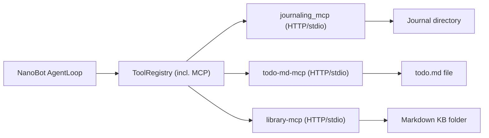

# Integrate Journaling, Todos, and Notes MCPs into Talon

## Goals

- **Expose journaling, todos, and notes MCP tools** to all Talon bots (WrenVPS, WrenAir, WrenPro) via NanoBot's existing `tools.mcpServers` mechanism.
- **Keep the fork rebase-friendly** by using configuration and external MCP services rather than touching NanoBot core logic.
- **Align with the Talon containerized pattern**, ideally routing these MCPs over HTTP (or an MCP bridge) so they are reachable from each bot's nanobot container.

## High-Level Architecture

- **MCP servers**:
  - `journaling_mcp` (Python, `uv`-run, writes Markdown journals under a configurable `JOURNAL_DIR`).
  - `todo-md-mcp` (Node, manages a single `todo.md` file configured via `TODO_FILE_PATH`).
  - `library-mcp` (Python, `uv`-run, indexes a Markdown knowledge base folder passed as CLI arg).
- **Runtime wiring** (already in repo):
  - `Config.tools.mcp_servers` schema in `[nanobot/config/schema.py](nanobot/config/schema.py)` and `load_config()` in `[nanobot/config/loader.py](nanobot/config/loader.py)`.
  - CLI passes `config.tools.mcp_servers` into `AgentLoop` in `[nanobot/cli/commands.py](nanobot/cli/commands.py)`.
  - `AgentLoop` lazily connects MCP servers via `connect_mcp_servers` in `[nanobot/agent/tools/mcp.py](nanobot/agent/tools/mcp.py)`, registering tools as `mcp_{server}_{tool}`.
- **Config entry points**:
  - Each Talon instance uses its own `config.json` (e.g. `~/.nanobot-wren-vps/config.json`) based on examples under `[examples/talon/](examples/talon/)`.
  - MCP servers are added under `tools.mcpServers` in those configs, as shown for `ntfy` and `bird`.

## Implementation Steps

### 1) Decide hosting & connectivity pattern

- **Confirm MCP access method** for Talon:
  - **Option A (preferred)**: Run each MCP as its own container (e.g. in the same Docker network) and expose an HTTP MCP endpoint, possibly via a central MCP bridge (e.g. `http://talon-mcp-bridge:3001/mcp/journaling`, `.../todo-md`, `.../library`).
  - **Option B (simpler to start)**: Run each MCP over stdio directly from the nanobot container using `command` + `args` (similar to current `ntfy` / `bird` examples) and rely on mounted volumes for their data directories.
- **Pick data locations** per role (rough sketch to solidify later):
  - Journals: instance-specific persistent directories (e.g. `~/.nanobot-wren-vps/journal`, `~/.nanobot-wren-air/journal`, `~/.nanobot-wren-pro/journal`).
  - Todos: one `todo.md` per instance (e.g. `~/.nanobot-wren-vps/todo.md`, etc.).
  - Notes: knowledge base roots per instance (e.g. VPS blog / personal notes, Air wired to Obsidian vault, Pro wired to work-only KB).

### 2) Add services (or bridge registrations) for the three MCPs

- **If using dedicated containers (HTTP/SSE)**:
  - Extend `docker-compose.yml` (or the higher-level Talon stack compose file) with three services, each built from or pulling the upstream MCP images / repos:
    - `talon-journaling-mcp` running `uv --directory /app/journaling_mcp run server.py`, mounting a host directory for `JOURNAL_DIR`.
    - `talon-todo-md-mcp` running `node dist/index.js` or `npx @danjdewhurst/todo-md-mcp`, mounting a host path for `TODO_FILE_PATH`.
    - `talon-library-mcp` running `uv --directory /app/library-mcp run main.py /data/library`, mounting `/data/library` from the host.
  - Expose each as an internal HTTP MCP endpoint (either directly or via `talon-mcp-bridge`), e.g. `http://talon-mcp-bridge:3001/mcp/journaling`, `.../todo-md`, `.../library`.
  - Ensure any required env vars (`JOURNAL_DIR`, `TODO_FILE_PATH`, etc.) are set via container `environment` with host volumes mounted read/write.
- **If using stdio from nanobot containers**:
  - Bake the MCP repos into the nanobot image (or mount them as volumes) and ensure `uv`/`node`/`npm` are available.
  - For each MCP, define a `command` + `args` pair mirroring the README examples (e.g. `command: "uv"`, `args: ["--directory", "/srv/journaling_mcp", "run", "server.py"]`).
  - Mount per-instance directories for journals, todos, and notes into the nanobot container and configure them via env (`JOURNAL_DIR`, `TODO_FILE_PATH`) or args (library KB path).

### 3) Wire MCP servers into each Talon instance config

- **Update example configs** under `[examples/talon/](examples/talon/)` as the canonical pattern:
  - In `wren-vps.config.json`, under `tools.mcpServers`, add three entries (`journaling`, `todo-md`, `library`), each pointing at its MCP endpoint (HTTP URL or stdio command), alongside existing `ntfy` and `bird`.
  - In `wren-air.config.json` and `wren-pro.config.json`, add the same three entries, possibly with different data roots (e.g. WrenAir notes pointing at an Obsidian vault path, WrenPro pointing at a work-only knowledge base).
- **Map per-instance data to MCP config**:
  - Journaling:
    - For stdio: set `env.JOURNAL_DIR` to an instance-specific path mounted into the container.
    - For HTTP via MCP bridge: configure each journaling MCP container with an instance-specific host volume and env, keeping personal vs work logs separated.
  - Todos:
    - Use `env.TODO_FILE_PATH` to point to an instance-specific `todo.md` file; ensure parent dirs exist on the host and are mounted.
  - Notes (library-mcp):
    - For stdio: include the KB root as the last arg (e.g. `"/root/.nanobot/library"`).
    - For HTTP: configure each library MCP container (or per-instance config) with the appropriate KB directory mounted.

### 4) Document usage and prompts for each MCP

- **Journaling (`mtct/journaling_mcp`)**:
  - Document typical flows in a Talon-focused doc (e.g. `docs/talon-journaling.md`): starting a session, using `mcp_journaling_start_new_session`, logging `record_interaction`, and retrieving recent journals.
  - Emphasize that the agent should treat it as a long-running journaling companion, not just a single-shot tool call.
- **Todos (`danjdewhurst/todo-md-mcp`)**:
  - Add a short doc (e.g. `docs/talon-todos.md`) explaining that todos are backed by a single `todo.md` file per instance and showing example natural-language prompts that map to `list_todos`, `add_todo`, `update_todo`, `delete_todo`, and `clear_completed`.
  - Clarify any conventions for separating personal vs work todos across instances.
- **Notes (`lethain/library-mcp`)**:
  - Add a doc (e.g. `docs/talon-notes-library.md`) describing the Markdown frontmatter expectations and how tags/date ranges are used.
  - Include examples that show retrieving posts by tag, searching by text, and using `rebuild` after editing/adding notes.

### 5) Validate end-to-end behavior for all bots

- **Per-instance smoke tests** (e.g. using `nanobot cli` into each config volume):
  - List tools and confirm `mcp_journaling_`*, `mcp_todo-md_`*, and `mcp_library_*` are visible for WrenVPS, WrenAir, and WrenPro.
  - Issue simple tool calls via natural language:
    - Journaling: "Start a new journaling session and record this reflection..." then "Show my recent journal entries".
    - Todos: "Add a todo to follow up with Alice" then "List my open todos".
    - Notes: "Search my knowledge base for posts tagged 'executive' and summarize the last 5.".
- **Data isolation checks**:
  - Verify that:
    - WrenVPS, WrenAir, and WrenPro write to **distinct** journal directories.
    - Each instance has its own `todo.md` file (no cross-contamination of personal/work todos).
    - Library-mcp instances operate on the intended KB roots (e.g. VPS personal notes vs Air Obsidian vault vs Pro work docs).

### 6) Optional: MCP bridge integration (if/when used)

- If you are using or plan to use a central `talon-mcp-bridge`:
  - Register the three MCPs in the bridge project (e.g. under `mcp-bridge/src/tools/`), mapping logical names (`journaling`, `todo-md`, `library`) to their backing containers or stdio commands.
  - Export them from the bridge's `index.ts` so they appear under HTTP paths like `/mcp/journaling`, `/mcp/todo-md`, `/mcp/library`.
  - Update Talon instance configs so `tools.mcpServers` for these three servers point at the bridge URLs instead of direct container hostnames.

This plan keeps changes largely in configuration and supporting docs, using NanoBot's existing MCP plumbing and Talon multi-bot patterns while giving all bots access to journaling, todos, and notes in a role-appropriate way.