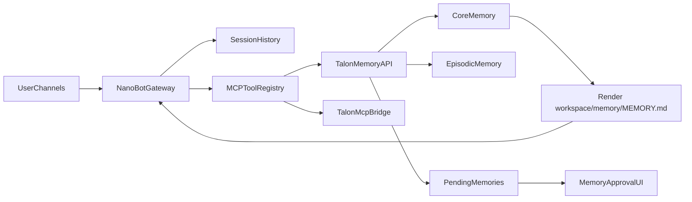

# NanoBot Talon Fork Plan

## Trade-Offs And Decision

- Chosen direction: `replace + minimal-fork`.
- Why: this avoids split-brain writes to `MEMORY.md`, keeps NanoBot close to upstream, and makes Talon memory services the clear system of record.
- Cost: NanoBot loses its built-in direct long-term memory authoring path, so the fork must explicitly replace that behavior with MCP-driven recall/propose flows and compatibility rendering.

## Memory Governance Policy

- `core memory`: human-approved only. NanoBot may propose candidates, but it cannot promote them into durable long-term memory by itself.
- `episodic memory`: auto-stored by NanoBot or memory-api without operator approval, because it functions as searchable recall rather than standing truth.
- `provisional memory`: bot-created, reviewable memory that can help future workflows, but expires or remains non-authoritative until a human promotes it to core memory.
- Product rule: self-approval is allowed for low-risk recall data, not for preferences, identity, standing instructions, or behavior-shaping facts.
- Architecture rule: promotion path is one-way through operator approval UI or an equivalent trusted admin action.

## Product Classification Matrix

- Route a memory to `core` when it should shape future behavior across sessions, must remain stable over time, or would be costly if wrong. Examples: user preferences, project identity, standing operating rules, trusted facts about environment or accounts.
- Route a memory to `episodic` when it is mainly useful as recall of what happened, what was tried, or what result occurred. Examples: conversations, failed deployments, research results, prior tool outputs, past decisions with timestamps.
- Route a memory to `provisional` when it looks useful but still needs confirmation, reinforcement, or expiry before it should shape long-term behavior. Examples: inferred preferences, tentative project conventions, suggested follow-ups, candidate summaries extracted from a conversation.
- Default behavior: if a memory changes how NanoBot should behave in the future, treat it as `core`; if it only helps NanoBot remember past context, treat it as `episodic`; if confidence is mixed, treat it as `provisional`.
- Promotion rules: `episodic` may inform future proposals but does not automatically become `core`; `provisional` may be promoted to `core` only by human approval.
- Expiry rule: `provisional` memories should be timestamped and eligible for review or expiration so they do not silently calcify into policy.

## Target Architecture

## Current Constraints To Design Around

- [nanobot/agent/context.py](nanobot/agent/context.py) always injects file-based memory into the prompt, so Talon must render the compatibility file to `workspace/memory/MEMORY.md` rather than repo-root `MEMORY.md`.
- [nanobot/agent/memory.py](nanobot/agent/memory.py), [nanobot/agent/loop.py](nanobot/agent/loop.py), and [nanobot/skills/memory/SKILL.md](nanobot/skills/memory/SKILL.md) currently let NanoBot write long-term memory itself; this must be disabled or redirected before Talon memory is authoritative.
- [nanobot/cron/service.py](nanobot/cron/service.py) and [nanobot/cron/types.py](nanobot/cron/types.py) use NanoBot's structured cron store, so the Talon memory port should target that schema or rely on memory-api internal scheduling instead of the draft array format in the planning doc.
- [docker-compose.yml](docker-compose.yml) and [Dockerfile](Dockerfile) are currently NanoBot-only and must be expanded without violating the architect rule: SSH-tunnel-only exposure, NanoBot <=256 MB, memory-api <=128 MB, total new services <=1 GB.

## Branch Strategy

- `talon/phase-0-architecture-seams`: introduce the NanoBot-side seams needed to remove direct long-term memory ownership.
- `talon/phase-1-memory-compat`: make `workspace/memory/MEMORY.md` a rendered compatibility artifact and stop NanoBot from treating it as self-authored state.
- `talon/phase-2-memory-api`: add [services/memory-api](services/memory-api) with core, episodic, pending, render, and MCP endpoints.
- `talon/phase-3-approval-ui`: add [services/memory-ui](services/memory-ui) and operator approval flow.
- `talon/phase-4-mcp-bridge`: add [services/mcp-bridge](services/mcp-bridge) for `searxng`, `ntfy`, and `bird` namespaces.
- `talon/phase-5-compose-cutover`: extend deployment, config, and cutover flow from test port to `18790`.
- Optional later branch: `talon/platform-memory-abstraction` if future development needs a deeper in-process memory backend abstraction inside NanoBot.

## Phase Plan

### Phase 0: Carve The Seams In NanoBot

- Update [nanobot/agent/memory.py](nanobot/agent/memory.py), [nanobot/agent/loop.py](nanobot/agent/loop.py), and [nanobot/skills/memory/SKILL.md](nanobot/skills/memory/SKILL.md) so NanoBot no longer presents itself as the owner/editor of long-term memory.
- Preserve session history in [nanobot/session/manager.py](nanobot/session/manager.py) as working memory.
- Add a small config switch in [nanobot/config/schema.py](nanobot/config/schema.py) and migration support in [nanobot/config/loader.py](nanobot/config/loader.py) for Talon mode, rather than hard-forking many call sites.
- Acceptance: NanoBot still runs normally, but no longer rewrites `workspace/memory/MEMORY.md` in Talon mode.

### Phase 1: Compatibility Memory File

- Keep [nanobot/agent/context.py](nanobot/agent/context.py) largely intact, but formalize that `workspace/memory/MEMORY.md` is read-only from NanoBot's perspective in Talon mode.
- Align the memory-port plan with NanoBot's real workspace layout: rendered file path should be `workspace/memory/MEMORY.md` and optional audit/history artifacts can remain under `workspace/memory/`.
- Decide whether `HISTORY.md` remains a NanoBot-owned append-only file or becomes deprecated once episodic recall is live; default recommendation is to de-emphasize it and keep episodic memory authoritative.
- Acceptance: prompt context still receives long-term memory, but the content is generated only by Talon memory-api.

### Phase 2: Talon Memory API

- Build [services/memory-api](services/memory-api) as the memory authority: Postgres schema, pgvector episodic recall, pending approvals, memory compiler, `MEMORY.md` renderer, REST endpoints, and MCP endpoint.
- Implement MCP tools from the memory port doc: `memory_recall`, `memory_propose`, `memory_get_core`, `memory_store_episodic`.
- Model the storage tiers explicitly in the API contract: `core`, `episodic`, and `provisional`, with promotion allowed only from trusted operator actions.
- Prefer memory-api internal scheduler for recompile/archive jobs first; only integrate NanoBot cron once the exact job format and ownership are settled.
- Acceptance: NanoBot can connect over MCP and retrieve/propose/store memory without any local file writes except consuming the rendered compatibility file.

### Phase 3: Approval Pipeline And UI

- Add [services/memory-ui](services/memory-ui) for pending approvals, approved browsing, and deny reasons.
- Wire memory-api to send `ntfy` notifications on new pending candidates.
- Define operator workflow clearly: proposal creation, notification, review, approval, recompile, render, next-prompt pickup.
- Encode approval semantics in the product flow: core proposals require approval, episodic entries bypass approval, and provisional entries can be reviewed, promoted, or expired.
- Acceptance: important durable facts require approval before appearing in rendered core memory.

### Phase 4: MCP Tooling Beyond Memory

- Add [services/mcp-bridge](services/mcp-bridge) for `searxng`, `ntfy`, and `bird` namespaces rather than baking those integrations into NanoBot core.
- Reuse NanoBot's existing remote MCP support in [nanobot/agent/tools/mcp.py](nanobot/agent/tools/mcp.py) and current config shape in [nanobot/config/schema.py](nanobot/config/schema.py).
- Keep secrets confined to env/config injection and never surface them in tool outputs.
- Acceptance: NanoBot discovers all Talon MCP servers from config and uses them as native tools without bespoke NanoBot code per tool.

### Phase 5: Deployment And Cutover

- Expand [docker-compose.yml](docker-compose.yml) to add `talon-memory-api`, `talon-memory-ui`, `talon-mcp-bridge`, `postgres`, plus existing `searxng` and `ntfy` wiring on `talon-net`.
- Update [Dockerfile](Dockerfile) and packaging only as needed for NanoBot runtime compatibility, not to embed Talon services into the NanoBot image.
- Stage cutover using the existing multi-instance NanoBot support described in [README.md](README.md): test on `18791`, validate channels and MCP, then cut over to `18790` with sub-minute downtime.
- Acceptance: zero-downtime migration path is documented and repeatable, and no public ports are exposed beyond localhost for SSH tunnel use.

## Testing And Verification

- Extend memory tests around [tests/test_memory_consolidation_types.py](tests/test_memory_consolidation_types.py) to cover Talon mode disabling or redirect behavior.
- Add NanoBot integration tests for MCP startup/discovery and Talon-mode prompt memory loading.
- Add service-level tests for memory-api schema migrations, render output, approval transitions, and episodic recall.
- Add deployment smoke tests similar to [tests/test_docker.sh](tests/test_docker.sh), but scoped to staged compose bring-up and health checks.

## Migration Notes

- Breaking change: in Talon mode, `workspace/memory/MEMORY.md` is no longer user- or agent-authored state; it is generated output.
- Breaking change: built-in NanoBot memory guidance must stop telling the model to edit `MEMORY.md` directly.
- Behavioral change: NanoBot may still auto-store episodic recall data, but it cannot self-approve permanent core memory.
- Migration step: seed core memory from existing markdown memory sources before enabling Talon mode in production.
- Migration step: keep session history untouched so active working-memory behavior survives the fork.

## Definition Of Done

- NanoBot no longer directly owns long-term memory writes in Talon mode.
- Talon memory-api is the only authority for core and episodic memory.
- Core memory is human-approved; episodic memory is auto-stored; provisional memory is non-authoritative until promoted.
- `workspace/memory/MEMORY.md` is rendered by memory-api and loaded by NanoBot without further NanoBot-side mutation.
- MCP bridge exposes memory, search, notify, and bird tools through stable remote endpoints.
- Docker compose supports staged test, approval workflow, and final cutover on `18790`.
- The fork remains intentionally shallow enough to rebase onto upstream NanoBot except for clearly bounded Talon seams.

